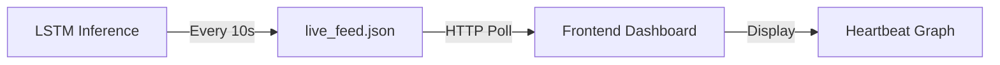
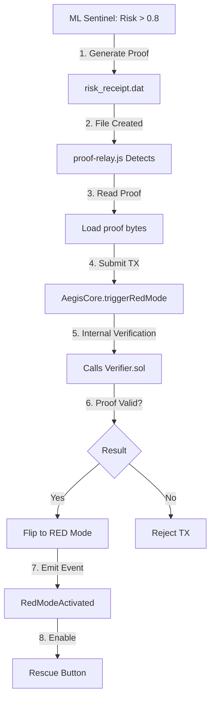

# Aegis Protocol - Decentralized Market Protection System

## 🎯 Overview

**Aegis Protocol** is a decentralized market defense system that combines real-time AI crash prediction with zero-knowledge cryptography and blockchain-based rescue mechanisms. The system protects user funds through automated detection of market instability and trustless verification of predictions.

**Core Innovation:** LSTM neural network predictions proven via Risc Zero zkVM, enabling on-chain verification without revealing model weights.

---

## � Repository Architecture

This is a **monorepo** containing three independent modules that communicate through well-defined handoffs:

```
aegis-protocol/
├── packages/
│   ├── ml-sentinel/                    # 🧠 The Intelligence (Member B)
│   │   ├── data-pipeline/              # Node.js market data crawler
│   │   │   └── src/crawler.js          # Real-time market depth scraper
│   │   ├── model/                      # LSTM crash prediction
│   │   │   ├── trained/
│   │   │   │   └── aegis_lstm_model.h5 # Trained model
│   │   │   └── inference.py            # ⭐ Real-time engine
│   │   └── zk-circuit/                 # Risc Zero proof generator
│   │       ├── risc0-verifier/         # zkVM implementation
│   │       │   ├── guest/src/main.rs   # LSTM in zkVM
│   │       │   └── host/src/main.rs    # Proof generator
│   │       └── prove_adapter.py        # Python → Rust bridge
│   │
│   ├── frontend-integration-data/      # 👁️ The Face (Member A)
│   │   └── public/
│   │       └── live_feed.json          # ⭐⭐ Real-time risk data
│   │
│   └── verification-proofs/            # 🏰 The Fortress (Member C)
│       ├── contracts/
│       │   └── Verifier.sol            # Risc Zero verifier
│       └── proofs/
│           └── risk_receipt.dat        # ⭐⭐ ZK proof output
│
├── frontend-cockpit/                    # Next.js Dashboard (Member A)
│   └── (reads live_feed.json + blockchain state)
│
└── packages/blockchain-evm/             # Smart Contracts (Member C)
    ├── contracts/
    │   ├── AegisCore.sol               # Main protocol logic
    │   └── Verifier.sol                # ZK verification
    └── scripts/
        └── proof-relay.js              # ⭐ File watcher
```

### Module Responsibilities

| Module | Owner | Purpose | Tech Stack |
|--------|-------|---------|------------|
| **ml-sentinel** | Member B | Market monitoring, risk prediction, ZK proof generation | Python (TensorFlow), Rust (Risc Zero), Node.js |
| **frontend-cockpit** | Member A | Real-time dashboard, user interface | Next.js, React, Tailwind |
| **blockchain-evm** | Member C | On-chain verification, rescue mechanism | Solidity, Hardhat, Ethers.js |

---

## 🔌 System Integration & Handoffs

**Philosophy:** No centralized API. Each module is independent and communicates through **file-based handoffs** and **blockchain events**.

### 🎨 Handoff 1: Frontend Integration (The Visuals)

#### How It Works

**1. ML Sentinel → Frontend Data Flow**



**File:** `packages/frontend-integration-data/public/live_feed.json`

```json
{
  "riskScore": 0.2648,
  "change24h": -12.5,
  "liquidityHealth": 0.9999,
  "timestamp": "2025-12-14T01:45:09Z",
  "status": "normal"
}
```

**Frontend Implementation:**

```javascript
// React example - polls every 3 seconds
useEffect(() => {
  const interval = setInterval(async () => {
    const res = await fetch('/live_feed.json');
    const data = await res.json();
    setRiskData(data); // Update heartbeat graph
  }, 3000);
  
  return () => clearInterval(interval);
}, []);
```

**2. Traffic Light State → Frontend**

**❗ CRITICAL:** The "Traffic Light" (🟢 Green / 🔴 Red) is **NOT** read from `live_feed.json`.

**Source:** Blockchain contract state via Web3

```javascript
// Read from AegisCore.sol
const contract = new ethers.Contract(AEGIS_CORE_ADDRESS, ABI, provider);
const isRedMode = await contract.isRedMode();

// Display traffic light
const trafficLight = isRedMode ? '🔴 RED - Rescue Active' : '🟢 GREEN - Normal';
```

**Why separate?** 
- **Heartbeat Graph**: Needs frequent updates (every 3s) → `live_feed.json`
- **Traffic Light**: Infrequent state changes → Blockchain query

---

### 🔗 Handoff 2: Blockchain Integration (The Trigger)

#### The File Watcher Pattern

**Problem:** How does the blockchain know when a crash is predicted?

**Solution:** The blockchain team runs a **Node.js file watcher** that monitors the proof directory.

```javascript
// blockchain-evm/scripts/proof-relay.js
const fs = require('fs');
const { ethers } = require('ethers');

const PROOF_DIR = '../../verification-proofs/proofs/';
const PROOF_FILE = 'risk_receipt.dat';

// Watch for new proofs
fs.watch(PROOF_DIR, async (eventType, filename) => {
  if (filename === PROOF_FILE) {
    const proof = fs.readFileSync(PROOF_DIR + PROOF_FILE);
    await relayProofToChain(proof);
  }
});

async function relayProofToChain(proofData) {
  const aegisCore = new ethers.Contract(AEGIS_CORE_ADDRESS, ABI, signer);
  
  // ⭐ CRITICAL: Call AegisCore.triggerRedMode(), NOT Verifier.verify()
  const tx = await aegisCore.triggerRedMode(proofData);
  await tx.wait();
  
  console.log('✅ Red mode activated on-chain');
}
```

#### Complete Flow



**Step-by-Step:**

1. **Generation (ML):** Sentinel detects `riskScore > 0.8`
   ```python
   # inference.py
   if risk_score > 0.8:
       generate_risc_zero_proof(model, market_sequence)
       # Writes to: verification-proofs/proofs/risk_receipt.dat
   ```

2. **Relay (Blockchain):** File watcher detects new proof
   ```javascript
   // Monitors: verification-proofs/proofs/
   // Triggers: When risk_receipt.dat changes
   ```

3. **Execution (Smart Contract):** `AegisCore.triggerRedMode(proof)`
   ```solidity
   function triggerRedMode(bytes calldata zkProof) external {
       // 1. Verify proof via Verifier.sol
       require(verifier.verifyProof(zkProof), "Invalid proof");
       
       // 2. Flip state
       isRedMode = true;
       
       // 3. Enable rescue
       emit RedModeActivated(block.timestamp);
   }
   ```

4. **Result:** System state changes to RED
   - Frontend polls: `await aegisCore.isRedMode()` → `true`
   - Rescue button appears on dashboard
   - Users can withdraw funds safely

**Key Insight:** `Verifier.sol` is **internal** to `AegisCore.sol`. The blockchain team never calls it directly - it's automatically invoked during `triggerRedMode()`.

---

## � Quick Start

### For ML Team (Member B)

**Run Inference Engine:**
```bash
python packages/ml-sentinel/model/inference.py
```

**What it does:**
- Monitors market data every 10 seconds
- Outputs to `frontend-integration-data/public/live_feed.json`
- Generates ZK proofs when risk > 0.8

**Test Proof Generation:**
```bash
cd packages/ml-sentinel/zk-circuit
python test_proof_generation.py
```

---

### For Frontend Team (Member A)

**1. Read Heartbeat Data:**
```javascript
// Poll live_feed.json every 3 seconds
const data = await fetch('/live_feed.json').then(r => r.json());
// Display: riskScore, change24h, liquidityHealth
```

**2. Read Traffic Light:**
```javascript
// Query blockchain state
const isRed = await aegisCoreContract.isRedMode();
// Show: 🟢 GREEN or 🔴 RED
```

---

### For Blockchain Team (Member C)

**1. Deploy Contracts:**
```bash
npx hardhat deploy --network sepolia
# Deploys: AegisCore.sol + Verifier.sol
```

**2. Run Proof Relay:**
```bash
node scripts/proof-relay.js
# Watches: verification-proofs/proofs/risk_receipt.dat
# Calls: AegisCore.triggerRedMode(proof)
```

---

## 🧪 Testing Integration

### End-to-End Test

**1. Generate Test Proof (ML):**
```bash
python packages/ml-sentinel/zk-circuit/test_proof_generation.py
# Creates: verification-proofs/proofs/risk_receipt.dat
```

**2. Relay detects new file (Blockchain):**
```
[proof-relay.js] New proof detected!
[proof-relay.js] Submitting to AegisCore...
[proof-relay.js] ✅ TX: 0xabc123... confirmed
```

**3. Frontend updates (Dashboard):**
```javascript
// Before: isRedMode = false → 🟢 GREEN
// After:  isRedMode = true  → 🔴 RED + Rescue Button
```

---

## 📋 Data Formats

### Frontend Data (`live_feed.json`)

| Field | Type | Range | Purpose |
|-------|------|-------|---------|
| `riskScore` | float | 0.0-1.0 | LSTM prediction (1.0 = 100% crash probability) |
| `change24h` | float | ±∞ | 24-hour trend (negative = risk decreasing) |
| `liquidityHealth` | float | 0.0-∞ | Buy Liquidity Ratio (>1.0 = healthy) |
| `timestamp` | string | ISO 8601 | When prediction was made |
| `status` | string | enum | `"normal"` \| `"warning"` \| `"critical"` |

### ZK Proof (`risk_receipt.dat`)

```json
{
  "risk_score": 0.8523,
  "proof_hash": "cd3fa70c21dcce8d...",
  "timestamp": 1702512000,
  "journal": {
    "public_output": 0.8523
  }
}
```

**Note:** In production (Linux + Risc Zero), this will be **binary data** (bincode serialization). For hackathon demo, it's JSON.

---

## � Security Model

### Zero-Knowledge Proofs

**Why?** Prove crash prediction is correct without revealing model weights (intellectual property).

**How?**
1. LSTM forward pass runs **inside** Risc Zero zkVM (Rust)
2. zkVM generates cryptographic proof of execution
3. Contract verifies proof on-chain
4. Model weights never leave the zkVM

**Implementation:**
- **Guest Code:** `packages/ml-sentinel/zk-circuit/risc0-verifier/methods/guest/src/main.rs`
- **Host Code:** `packages/ml-sentinel/zk-circuit/risc0-verifier/host/src/main.rs`
- **Verifier:** `packages/verification-proofs/contracts/Verifier.sol`

---

## 📦 Dependencies

### ML Sentinel
```bash
pip install tensorflow numpy pandas
# For ZK (production): Rust + cargo-risczero
```

### Frontend
```bash
npm install ethers  # For Web3 queries
# No special deps for live_feed.json polling
```

### Blockchain
```bash
npm install hardhat ethers
# Deploy: AegisCore.sol + Verifier.sol
```

---

## 🤝 Team Collaboration

| Task | Team | Deliverable |
|------|------|-------------|
| **Generate risk data** | ML (B) | `live_feed.json` updated every 10s |
| **Generate ZK proofs** | ML (B) | `risk_receipt.dat` when risk > 0.8 |
| **Display heartbeat** | Frontend (A) | Poll `live_feed.json`, render graph |
| **Display traffic light** | Frontend (A) | Query `AegisCore.isRedMode()` |
| **Relay proofs** | Blockchain (C) | Watch proof file, call contract |
| **Verify & flip state** | Blockchain (C) | `AegisCore.triggerRedMode()` |

---

## 🎯 Production Checklist

- [ ] **ML:** Inference engine running as service (systemd/Windows Service)
- [ ] **ML:** ZK proofs auto-generate when risk > 0.8
- [ ] **Frontend:** Dashboard polls `live_feed.json` every 3 seconds
- [ ] **Frontend:** Queries `AegisCore.isRedMode()` for traffic light
- [ ] **Blockchain:** Proof relay script running as background service
- [ ] **Blockchain:** `AegisCore.sol` + `Verifier.sol` deployed to mainnet
- [ ] **All:** Error handling for network issues, missing files
- [ ] **All:** Monitoring & alerting for all components

---

## 📞 Support & Troubleshooting

**ML Issues:**
- Check logs: `packages/ml-sentinel/logs/sentinel.log`
- Verify model exists: `packages/ml-sentinel/model/trained/aegis_lstm_model.h5`

**Frontend Issues:**
- Ensure `live_feed.json` is accessible via HTTP
- Check browser console for fetch errors

**Blockchain Issues:**
- Verify proof relay is running: `ps aux | grep proof-relay`
- Check contract events: `AegisCore.RedModeActivated`

---

## � Architecture Highlights

**✅ Decentralized:** No central server - files + blockchain  
**✅ Trustless:** ZK proofs verify predictions cryptographically  
**✅ Modular:** Three independent teams, clean interfaces  
**✅ Real-time:** 10-second inference, 3-second frontend updates  
**✅ Scalable:** File-based handoffs support horizontal scaling  

---

**Built by Team Aegis for ETHIndia 2024** 🚀
